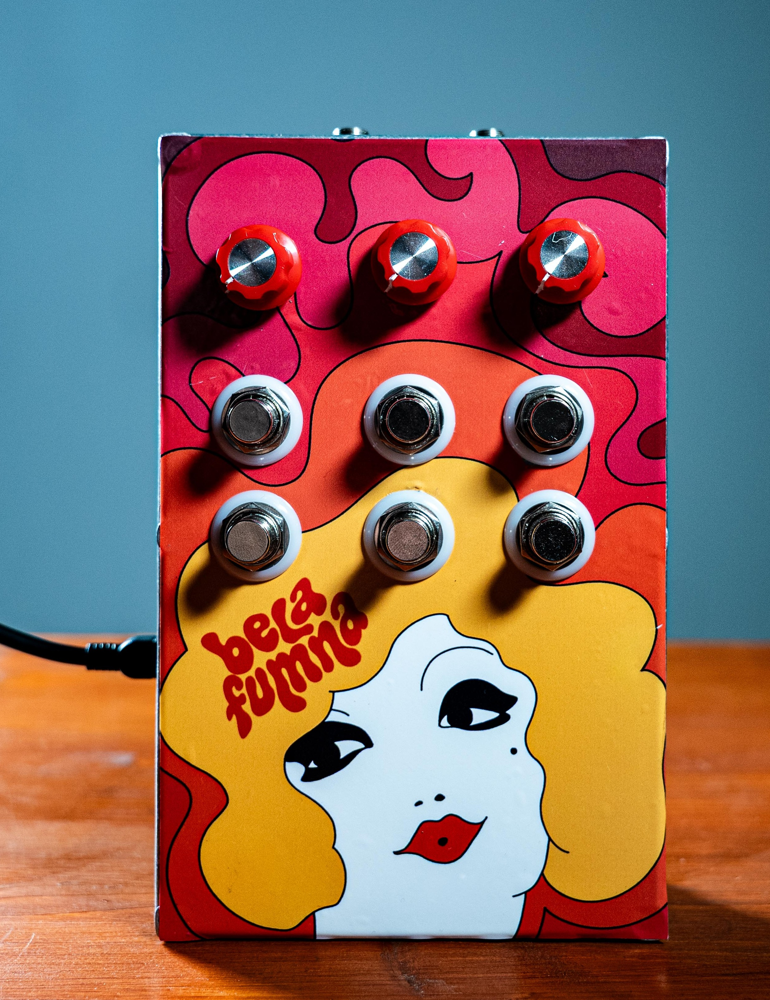
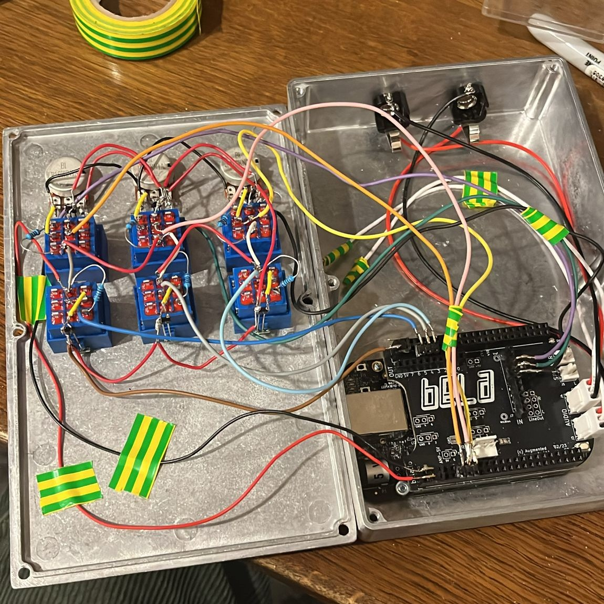
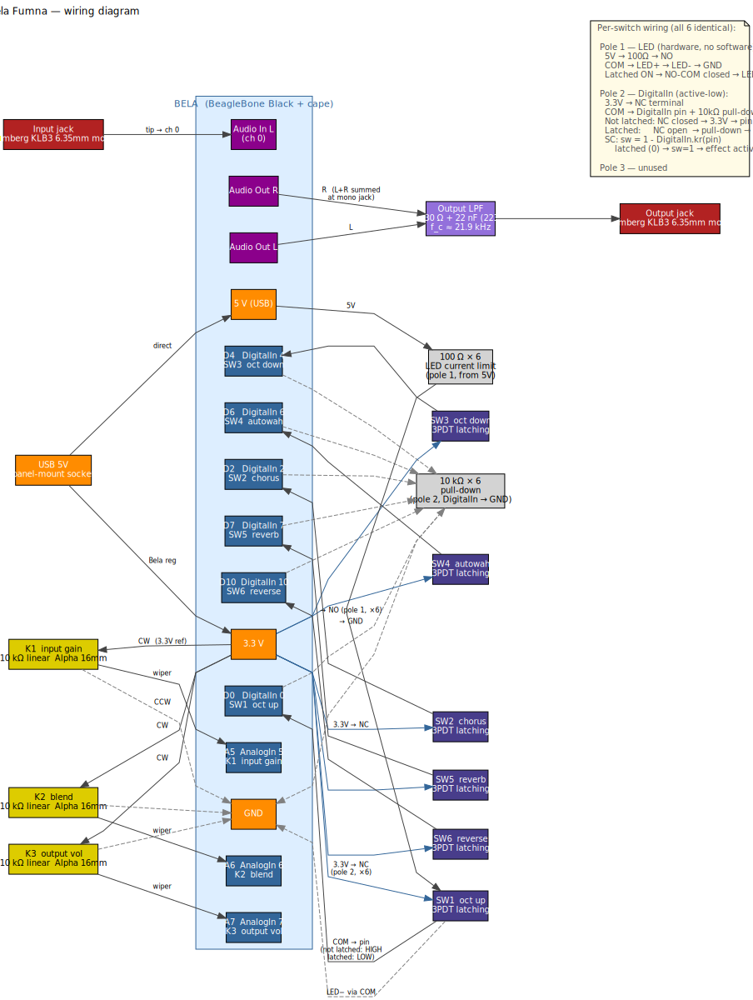
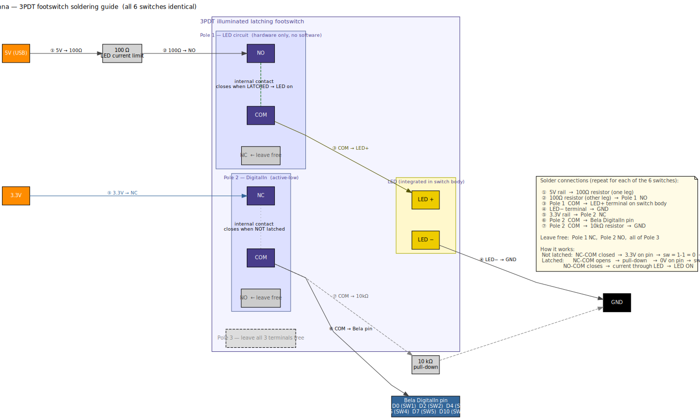
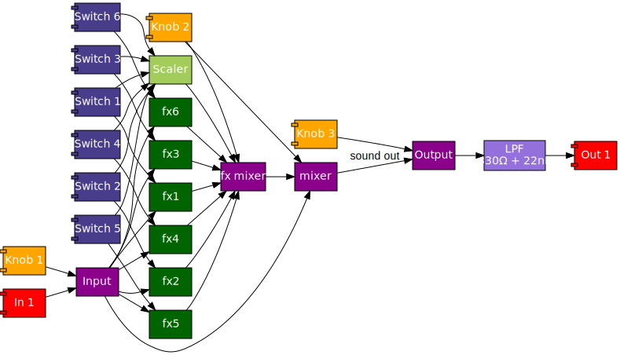

# Bela Fumna



**Bela Fumna** is a custom multi-effects stompbox for electric bass, built on the [Bela](https://bela.io) embedded audio platform and programmed in [SuperCollider](https://supercollider.github.io). It is designed for live bass performance.

The name is a Piedmontese pun: *Bela* (the platform) + *fumna* (Piedmontese dialect for *donna*/woman — also evoking the plant *Atropa belladonna*, attractive on the surface, dangerous in its effects).

See the companion paper for the theoretical framework: *The Expanded Pedal: Recoupling Interface and Computation in an Embedded Live Effects Unit* (CIM 2026).

---

## Instrument context

The pedal is played by a bassist performing live. The signal chain is:

```
6-string bass → Bela Fumna → preamp/DI → PA
```

Design priorities are stability, instant recall, and a small number of well-chosen effects that work well for bass.

---

## Hardware

### Platform
- **Bela Starter Kit** (BeagleBone Black + Bela cape), powered via USB 5V

### Enclosure
- Diecast aluminium, 187 × 118 × 38 mm, 0.66 kg

### Controls
- **SW1–SW6** — 6 illuminated latching 3PDT footswitches
- **K1** — Input gain
- **K2** — Dry/wet blend
- **K3** — Output volume

### Audio I/O
- Input: Lumberg KLB3 6.35mm mono jack
- Output: Lumberg KLB3 6.35mm mono jack
- Both stereo channels of the Bela codec wired to each mono jack (required — leaving either channel floating produces noise)
- Output LPF: 330Ω + 22nF (f_c ≈ 21.9 kHz), attenuates sigma-delta converter noise before nonlinear downstream stages

### Power
- USB 5V, 1A minimum (panel-mount micro-USB socket on enclosure)

### Suppliers
- Bela board: [eu.shop.bela.io](https://eu.shop.bela.io)
- Enclosure, footswitches, knobs, pots, jacks, resistors: [Musikding.de](https://www.musikding.de)

### Wiring



Electronic wiring diagram of the full pedal:



Per-switch soldering guide (all 6 switches identical):



---

## Software architectures

Bela Fumna illustrates the reprogrammability of the expanded pedal through two alternative SC implementations, with different effect sets and different internal architectures. Both share the same hardware; only the code on the Bela changes.

All processing runs in SuperCollider on Bela. There is no hardware true bypass — dry/wet and bypass are handled in software via `XFade2`. Switching is arithmetic: each effect output is multiplied by its footswitch state, and the wet mix is normalised by the count of active effects to prevent level jumps on toggle.



---

### Architecture 1 — Monolithic (deployed)

**File:** `nickelodeon20260507/_main.scd`

A single monolithic `\multiFX` SynthDef containing all processing paths. This architecture was arrived at by performance testing: a multi-SynthDef prototype introduced inter-Synth bus overhead sufficient to cause xruns on the Cortex-A8. Collapsing everything into one SynthDef eliminates bus traffic and allows the SC graph compiler to optimise across local variables.

All six effects are computed unconditionally on every audio block — even when bypassed. This eliminates the graph-restructuring overhead of dynamically adding/removing Synth nodes, which on a single-core system is more disruptive than computing a bypassed signal and multiplying it by zero.

#### Hardware mapping

| Pin | Control |
|---|---|
| `AnalogIn` 5 | K1 input gain (0.25–2.0 linexp) |
| `AnalogIn` 6 | K2 dry/wet blend |
| `AnalogIn` 7 | K3 output volume (0.25–2.0 linexp) |
| `DigitalIn` 0 | SW1 oct up |
| `DigitalIn` 2 | SW2 chorus |
| `DigitalIn` 4 | SW3 oct down |
| `DigitalIn` 6 | SW4 autowah |
| `DigitalIn` 7 | SW5 reverb |
| `DigitalIn` 10 | SW6 reverse |

Switches are active-low (`1 - DigitalIn.kr(...)`).

#### Effects

| Effect | Implementation |
|---|---|
| Oct up | `PitchShift.ar` (ratio ×2, windowSize 0.2) |
| Oct down | `ToggleFF` zero-crossing divider → `LPF` |
| Autowah | `Amplitude.ar` envelope follower → `MoogFF` cutoff |
| Reverb | 3× `CombC` parallel → 2× `AllpassC` → `LPF` |
| Chorus | 2× modulated `DelayC` driven by quadrature `SinOsc` LFOs |
| Reverse | Swept `DelayC` + `FreqShift` with windowed amplitude envelope |

#### Signal flow

```
SoundIn → K1 gain → ─────────────────────────────────────────── dry ─────┐
                     ├── oct up   × SW1 ─┐                                │
                     ├── oct down × SW2 ─┤                                │
                     ├── autowah  × SW3 ─┼── Σ / nActive = wet ── XFade2 ── K3 → Out
                     ├── reverb   × SW4 ─┤                                │
                     ├── chorus   × SW5 ─┤                           K2 blend
                     └── reverse  × SW6 ─┘
```

#### Server options (Bela)

```supercollider
s.options.numAnalogInChannels  = 8;
s.options.numAnalogOutChannels = 8;
s.options.numDigitalChannels   = 16;
s.options.blockSize            = 16;
```

---

### Architecture 2 — Distributed (modular alternative)

**Files:** `bela_fumna_bela.scd` (Bela hardware) · `bela_fumna_laptop.scd` (laptop/GUI)

A modular implementation using separate SynthDefs connected by audio buses. Each effect runs in its own Synth node; a `\bfMixer` node handles gating and dry/wet blending. This is the architecturally cleaner design from a software engineering standpoint — each effect is independently encapsulated and slots can be hot-swapped at runtime via `~swapSlot` — but it introduced inter-Synth bus overhead on the Cortex-A8 that led to xruns at low block sizes.

The distributed architecture uses a different effect set (freeze and sampler in place of reverb, chorus, reverse) and a different hardware wiring (D0–D5 contiguous, A0–A2 for knobs).

#### Hardware mapping (distributed version)

| Pin | Control |
|---|---|
| `AnalogIn` 0 | K1 input gain (0.25–4.0 linexp) |
| `AnalogIn` 1 | K2 dry/wet blend |
| `AnalogIn` 2 | K3 output gain (0.25–4.0 linexp) |
| `DigitalIn` 0 | SW1 oct down |
| `DigitalIn` 1 | SW2 oct up |
| `DigitalIn` 2 | SW3 autowah |
| `DigitalIn` 3 | SW4 spectral freeze |
| `DigitalIn` 4 | SW5 sampler A |
| `DigitalIn` 5 | SW6 sampler B |

Switches are active-low (`1 - DigitalIn.kr(...)`).

#### Effects

| SW | Effect | SynthDef | Implementation |
|---|---|---|---|
| SW1 | Oct down | `\bfOctDown` | Ring modulation (`sig × SinOsc(freq×0.5)`), pitch-tracked, `MoogFF` 400 Hz |
| SW2 | Oct up | `\bfOctUp` | `PitchShift.ar` (ratio ×2) |
| SW3 | Autowah | `\bfAutowah` | `Amplitude.ar` → dB → `linexp` → `MoogFF` |
| SW4 | Spectral freeze | `\bfFreezeSpectral` | `PV_MagFreeze` (reads `DigitalIn` 3 directly) |
| SW5 | Sampler A | `\bfSamplerCue` | `Onsets.kr`-triggered `PlayBuf`, start position mapped from pitch |
| SW6 | Sampler B | `\bfSamplerCue` | same, second buffer |

Pitch tracking uses `Pitch.kr` (minFreq 30 Hz, for 6-string bass low B ≈ 30.9 Hz).

#### Signal flow

```
SoundIn → K1 gain → dry bus ──────────────────────────────── dry ─────┐
                              ├── \bfOctDown  → fxBus[0] × SW1 ─┐    │
                              ├── \bfOctUp    → fxBus[1] × SW2 ─┤    │
                              ├── \bfAutowah  → fxBus[2] × SW3 ─┼── Σ / nActive = wet ── XFade2 ── K3 → Out
                              ├── \bfFreeze   → fxBus[3] × SW4 ─┤              K2 blend
                              ├── \bfSampler  → fxBus[4] × SW5 ─┤
                              └── \bfSampler  → fxBus[5] × SW6 ─┘
```

#### Runtime slot swap

A running slot can be replaced without rebooting:

```supercollider
~swapSlot.(0, \bfOctDown)
~swapSlot.(4, \bfSamplerCue, [\bufnum, ~buf0.bufnum])
```

#### Server options (Bela)

```supercollider
s.options.numAnalogInChannels  = 4;
s.options.numAnalogOutChannels = 2;
s.options.numDigitalChannels   = 8;
s.options.blockSize            = 64;
s.options.memSize              = 65536;
```

---

## File structure

```
belaFumna/
├── nickelodeon20260507/
│   └── _main.scd               # Monolithic architecture — deployed Bela code
├── bela_fumna_bela.scd         # Distributed architecture — Bela hardware version
├── bela_fumna_laptop.scd       # Distributed architecture — laptop/GUI version
├── bela_fumna_template.scd     # Monolithic template — correct pins, empty DSP slots
├── belaInputTester.scd         # Hardware diagnostic: polls AnalogIn/DigitalIn pins
├── arch.dot / arch.svg         # Signal-flow diagram
├── wiring.dot / wiring.svg     # Electronic wiring diagram (full pedal)
├── switch_wiring.dot / switch_wiring.svg  # 3PDT switch soldering guide
└── _archive/                   # Superseded code (gitignored — local reference only)
```

### Running on Bela

**Monolithic (deployed):**

1. Connect Bela via USB and open `http://bela.local`.
2. Create a SuperCollider project named e.g. `belafumna`.
3. Upload `nickelodeon20260507/_main.scd` as the project's main file.
4. Click **Run**.

To set the project to run automatically on boot:

```bash
ssh root@bela.local
make -C /root/Bela PROJECT=belafumna startup
```

**Distributed (Bela):**

Same procedure using `bela_fumna_bela.scd`. Adjust sample paths in the buffer loading section to match your Bela project directory.

### Laptop development

Use `bela_fumna_laptop.scd` in the standard SC IDE. The file replaces all `AnalogIn`/`DigitalIn` calls with GUI sliders and buttons. Update the sample buffer paths to point to local files.

---

## Design notes

### Hardware

- **Output LPF** (330Ω + 22nF): placed on the Bela audio output to attenuate sigma-delta converter out-of-band noise before nonlinear downstream stages (preamp/DI).
- **Bela mono wiring:** Bela's codec requires both stereo channels connected. Both L and R outputs are wired to the mono output jack. Leaving either floating results in no signal or noise.
- **Switches:** 3PDT latching, active-low. Pole 1 drives the LED (hardware only). Pole 2 feeds a Bela DigitalIn via a 10kΩ pull-down. See `switch_wiring.svg` for the full soldering guide.

### SuperCollider / Bela

- **Monolithic SynthDef:** all six effects run unconditionally on every block. Computing a bypassed signal and multiplying by zero is cheaper on a single-core system than dynamic graph restructuring.
- **`s.sync`** requires a `Routine` context; all server-synchronous code is wrapped accordingly.
- **GUI calls** from non-AppClock threads use `.defer`.

---

## UGen CPU benchmark

A systematic benchmark of SC UGens on the Bela AM335x (Cortex-A8, single-core) was conducted to inform implementation decisions. Key findings:

- Baseline scsynth overhead: 35–40% CPU at blockSize 8, 10–15% at blockSize 64
- Most oscillators, filters, delays, and dynamics: safe at any block size
- `GVerb`, `PV_MagFreeze`, `PV_MagSmear`: require blockSize ≥ 64
- `Pitch.kr`: requires blockSize ≥ 128 (large analysis window for bass frequencies)
- FFT buffer size and dropout threshold scale proportionally

Full benchmark code and results are documented in the companion paper.

---

## Related resources

- Bela platform: https://bela.io
- SuperCollider on Bela: https://blog.bela.io/live-coding-sensors-with-supercollider/
- Bela hardware reference: https://learn.bela.io/using-bela/about-bela/bela-hardware/

---

## Authors

Giacomo Sapienza (RKH Studio / Conservatorio G. Verdi di Torino) ·
Andrea Valle (CIRMA/StudiUm, Università di Torino)

---

## Licence

MIT
